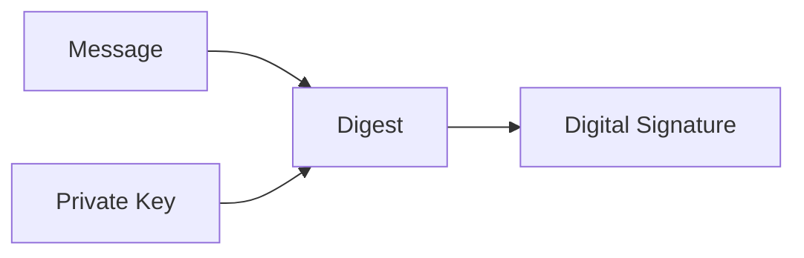
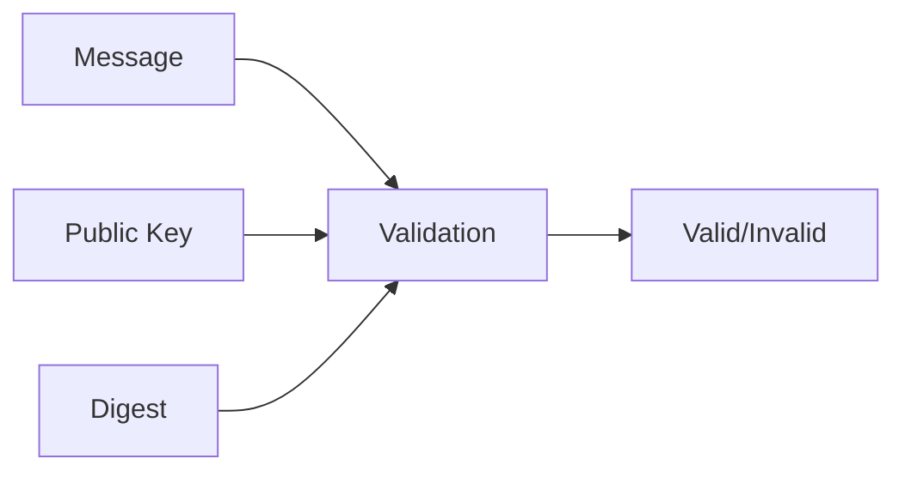
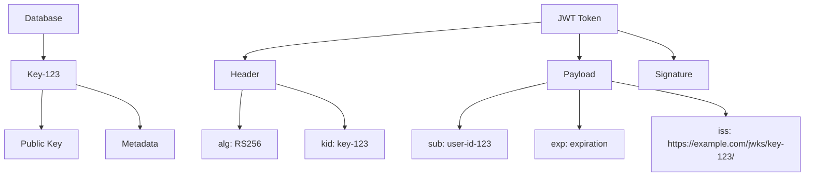

# japikey_js

Server-side Javascript library for API Key management

API Keys are a common pattern to give users, scripts, and AI Agents access to a resource without requiring them to log in.
An API key needs to reference the user, have scopes limiting the access allowed, and be secure.

This repository implements a core library & web route extensions to accomplish this in a secure, manner. With japikey there are:

- Zero secrets stored in the database. All information is public
- API keys cannot be tampered once created, even by the server
- API keys can be revoked
- Clients can validate API keys with caching (using JWKS)
- Clients can attest that the api key was emitted by a particular server

Interested in learning more? Check out the [How It Works](#how-it-works) section

# Getting Started

For express applications, see the [Express quickstart](./docs/express.md)

For cloudflare workers, see [Cloudflare quickstart](./docs/cloudflare.md)

# Technology Refresher

japikey relies on the standards of public/private key cryptography, via the JWT and JWKS format. Because each of these core pieces are important, let's spend a moment to recap the core features that are used.

## Public/Private Key cryptography

Using a math formula, we can generate two sets of numbers A (public), and B(private), such that:

- Everyone, including any malicious person can know what the Public Key number is
- It is not computationally feasible to figure out what the Private Key number is, even if you can change any data
- Given a message M, you can create a digest D with the Private key
- The digest is a hash, so changing any part of the message will change the digest, and it's just as likely that any bit in the digest may change from modification
- This also implies it's not computationally feasible to generate two different messages that share the same digest

**Signing Process**: The private key and message are used to create a digest, which becomes the digital signature.



**Verification Process**: The message, public key, and digest are used to validate the signature.



This process ensures:

- **Authenticity**: Only the private key holder could have created the signature
- **Integrity**: Any modification to the message will result in a different hash
- **Non-repudiation**: The sender cannot deny creating the signature

## JWT

[JWTs](https://www.rfc-editor.org/rfc/rfc7519) are a base64 encoded string with three parts, separated by periods. The three parts are `header`, `payload`, and `signature`. Each part, once base64 decoded, is a JSON object, containing both standardized and user-defined fields. The Header contains information about the type of cryptography used. For our scenario, the JWT's will always be signed with public/private key cryptography, so the `alg` key in the header will be `RS256`.
The payload contains [standard](https://www.rfc-editor.org/rfc/rfc7519#section-4.1) information such as the user id (`sub` field), the expiration time of the token (`exp`), which server issued it (`iss`) and more. Additionally, you can put any other JSON information you want in this part. Lastly, the signature part is the cryptography digest of the first two pieces, and then base64 encoded

In practice, we can use the header to confirm the type of cryptography used, and then use the digest to ensure the message has been signed by the server and not tampered with.

If you'll recall from the public/private key section, to verify a message we need the message, digest, and the public key. We can see that the JWT contains the message and the digest. Where does the public key come from? That's what JWKS is for

## JWKS

JWKS is a json file, located at `some_url/.well-known/jwks.json`. Essentially, it contains multiple public keys. Each public key has an id, called a `kid`. This `kid` matches up with the key id in the JWT header. Putting it all together, the logic to verify a JWT is this:

1. Inspect the `iss` (issuer) field to see who generated the token. Make sure this is one of the issuers you expect to receive a token from
1. Download the `issuer_url/.well-known/jwks.json` file to list all the currently-active public keys
1. Inspect the `kid` field in the header of the JWT to see which public key should be used. Select the corresponding public key from the `jwks.json` file
1. Validate the digest signature, using the message and public key

There is one additional benefit of using JWKS in this manner, instead of e.g. hardcoding the public key in any of the client's code: It is easy to revoke any key signed with a particular key, just by removing it from the jwks.json file

# How it works

Now that we have a good understanding of the core technologies, we can talk about how japikeys works. When a user wants to create an API key, japikeys generates a brand-new public/private keypair.

Then, the following claims are added to the JWT:

- header: `{"alg": "RS256", "kid":"key-123"}`
- claims: `{"sub": "user-id-123", "iss": "https://mydomain/jwks/key-123", "exp": someDateInTheFuture...}`

and then the JWT is signed with the private key. Following signing, the private key is discarded, **never to be saved or used again**. This way, once generated, nobody, not even the server can modify the API key. An attacker also can't use the private key to change any of the claims because it no longer exists.

Once generated, the last step is to store the public key, along with some metadata (which user is the API key for, expiry, etc. in a database or other durable storage).



The final thing the server needs to do is host a route for `https://example.com/jwks/{:key_id}/.well-known/jwks.json`
The handler should take the `key_id`, look it up in the database, and return the matching public key in JWKS format. And that's it!

With this implementation, anyone (the client, the server, or anyone on the internet) can validate the API key with code like this:
(error handling ommitted for brevity)

```
import * as jose from 'jose';
const unverified = jose.decodeJwt(token);
if (!/^https:\/\/example\.com\/jwks\/[0-9a-f-]{36}\/$/.test(unverified.iss)) return false; // Reject unexpected issuers
const jwks = jwks.createRemoteJWKSet(unverified.iss);
jose.jwtVerify(token, jwks);
```

It is extremely important that the clients have a strict allowlist for the issuer here. Otherwise, an attacker could create their own key, but pointing to a different issuer that they control. Since the issuer is used, before validation, this is explicitly something that has to be checked for.

And that's it! To query the list of active API keys, the server can use the database to view the keys and their metadata. Expired keys can optionally be reaped if desired.
Keys will expire automatically without any active action. Once the `exp` field is in the past, then `jwtVerify` will automatically fail. Revoking a key is as simple as removing the key from the database.

## Thoughts on jwks.json

Typically, the jwks can be cached for some period of time, in order to save an extra network lookup to grab the public key. We could keep the same behavior by having one global jwks.json file. This file would need to contain a new public key for every active API key. So, if there are 1,000 outstanding API keys, then this JSON file would have 1,000 entries in it. Additionally, even if that were the case, you still couldn't cache it for too long a time, because it's constantly being updated with new API keys as they are created.

Instead, we play around with the issuer. By changing the base url, we're able to self-encode that extra bit of information the server needs to return just a subset of information. With this trick, we know the key id, and the JWKS will always have zero or one hits, since the key id's are unique. On the caller side, this also has the benefit that the jwks payload, once you get a result, is (mostly) immutable. You don't have to worry about the key changing. However, you do need to refresh in order to catch API key revocation. That tradeoff is left as an security consideration to the client. You can check the jwks.json every time with the cost of some latency, or you can e.g. have an LRU cache of jwks and expire them as your policy finds reasonable (5 minutes, 1 hour etc).

## S3 bucket

An alternative to dynamically querying the database for the `.well-known/jwks.json` route would be to just create the .json payload once during API key creation time, and upload that to e.g. S3 or some other static hosting. As mentioned, the only time this would need to be modified is in case of API key revocation, making this something that can be easily hosted without worrying about caching, or compute.

## No secret data

The private key is the only secure piece of information in this whole process. As mentioned, we're purposefully discarding it, so there's no worry of it leaking. The public key in jwks.json is always meant to be public, so that's not an issue. If someone were to enumerate your website for all of the jwks.json files, they could only figure out the total number of API keys, but not any other information. You can also prevent this by detecting brute-force attacks (since it's a UUID) and blocking the crawler.

The only data not already exposed to the world is the metadata in the database. However, this isn't any particularly sensitive information. Presumably you already have e.g. the `userId` elsewhere in your database. Even with the metadata, you can't tweak the API keys, since you need the private key

# Security considerations

Most of the primary security challenges are outside the scope of this library. The API key server, as well as the database need to be secured. Compromise of either would allow an attacker to insert their own public key into the database, granting access.

Authorization of all the endpoints is also outside the scope of this library. Any user-confusion or other attacks could allow an attacker to create an API key they don't have access to.

As mentioned, validating the API key comes with one hard requirement - that the `issuer` is validated from an allowlist. This has to be done every place an API key is used, potentially increasing the risk of improper validation.

API key revocation is also dependent on verifiers refreshing the JWKS public key info. If a client incorrectly caches the data, the revocation won't be detected. This can be an easy mistake to make because many JWKS implementations have caching built-in.

# Performance considerations

Public/Private Key validation is slower than symmetric algorithms. If you are shaving nanoseconds, then this probably isn't the right implementation for you. Even more expensive is generating a public/private key (which also requires enough entropy in the system). This is only done when creating an api key (and is presumably a less-common and less time-sensitive operation).

In general, a JWT is also a larger header than other authentication schemes. If every byte matters, then consider something else.
